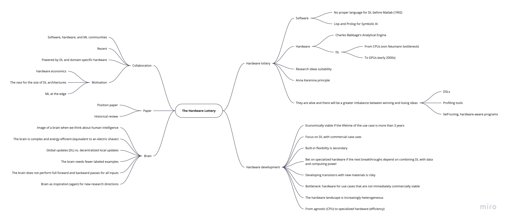

# Machine Learning

## Table of Contents

- [Courses](#courses)
  - [MIT 6.S191: Introduction to Deep Learning]()
- [Papers/Articles](#papersarticles)
  - [`The Hardware Lottery`](#p1)
  - [`On the Dangers of Stochastic Parrots: Can Language Models Be Too Big? 🦜`](#p2)

## Courses

### MIT 6.S191: Introduction to Deep Learning

#### Lecture 1: Intro to Deep Learning

- Deep Learning: extract patterns/features from (raw) data using neural networks.

---

## Papers

The (bullet point) text enclosed in double quotation marks refers to quotes from the author(s) of the respective paper.

---

### P1

[`The Hardware Lottery`](https://arxiv.org/abs/2009.06489) | Sara Hooker | 2020 | [Mind map](https://miro.com/app/board/o9J_kiSTlaI=/)

Monday, October 5, 2020

**Mind map**:

**Quotes, notes, and takeaways**:

- Note: This paper "(...) is part **position paper** and part **historical review**."
- **Hardware lottery**: "(...) when a research idea wins because it is suited to the available software and hardware and _not_ because the idea is superior to alternative research directions."
  - "In the field of artificial intelligence research, (...) it is our tooling which has played a disproportionate role in deciding what ideas succeed (and which fail)."
  - "(...) most computer science breakthroughs follow the Anna Karenina principle."
  - Anna Karenina principle: "(...) 'a deficiency in any one of a number of factors dooms an endeavor to failure.'"
- "(...) gains from progress in computing are likely to become even more **uneven**, with certain research directions moving into the fast-lane while progress on others is further obstructed."
- "After decades of treating hardware, software and algorithms as separate choices, the catalysts for closer collaboration include changing hardware economics (...), a 'bigger is better' race in the size of deep learning architectures (...) and the dizzying requirements of deploying machine learning to edge devices (...)."
- "Closer collaboration has centered on a wave of new generation hardware that is 'domain specific' to optimize for commercial use cases of deep neural networks (...)."
- "While domain specialization creates important efficiency gains for mainstream research focused on deep neural networks, it arguably makes it more even more costly to stray off of the beaten path of research ideas."
  - Domain-specific languages, self-tuning, hardware-aware programs, and profiling tools might help.
- "It is impossible to think of our cognitive intelligence without summoning up an image of the hardware it runs on [(brain)]."
- "Perhaps the **most salient example** of the damage caused by not winning the hardware lottery is the delayed recognition of **deep neural networks** as a promising direction of research [(Charles Babbage's Analytical Engine is another example)]."
  - "This gap between algorithmic advances and empirical success is in large part due to incompatible hardware."
  - "CPUs are very good at executing any set of complex instructions but incur high memory costs because of the need to cache intermediate results and process one instruction at a time [(von Neumann bottleneck)]."
  - von Neumann bottleneck:
    - "(...) the available compute is restricted by 'the lone channel between the CPU and memory along which data has to travel sequentially' (...)."
    - "(...) terribly ill-suited to matrix multiplies (...)."
- "It would take a hardware fluke [(an unexpected adaptation of GPUs)] in the early 2000s, a full four decades after the first paper about backpropagation was published, for the insight about massive parallelism to be operationalized in a useful way for connectionist deep neural networks."
- "The widespread and sustained popularity of symbolic approaches to AI cannot easily be seen as independent of how readily it fit into existing programming [(Lisp and Prolog)] and hardware frameworks."
- "To improve efficiency, there is a shift from task agnostic hardware like CPUs [(from the _general purpose era_ powered by Moore’s law and Dennard scaling)] to domain specialized hardware that tailor the design to make certain tasks more efficient."
- "Hardware is only economically viable if the lifetime of the use case lasts more than three years (...). Betting on ideas which have longevity is a key consideration for hardware developers. Thus, co-design effort has focused almost entirely on optimizing an older generation of models [(_traditional_ Deep Learning)] with known commercial use cases [(priority)]."
  - "There are also high risk efforts to explore the development of transistors using new materials (...)."
  - "The bottleneck will continue to be funding hardware for use cases that are not immediately commercially viable."
- "(...) specialized hardware makes sense if you think that future breakthroughs depend upon pairing deep neural networks with ever increasing amounts of data and computation."
- Comparison with the **brain**:
  - "Human brains despite their complexity remain extremely energy efficient. Our brain has over 85 billion neurons but runs on the energy equivalent of an electric shaver (...)."
  - "While algorithms like deep neural networks rely on global updates in order to learn a useful representation, our brains do not. Our own intelligence relies on decentralized local updates which surface a global signal in ways that are still not well understood (...)."
  - The brain needs far fewer labeled examples.
  - "(...) evidence suggests that the brain does not perform a full forward and backward pass for all inputs. Instead, the brain simulates what inputs are expected against incoming sensory data. Based upon the certainty of the match, the brain simply infills. What we see is largely virtual reality computed from memory (...)."

---

### P2

[`On the Dangers of Stochastic Parrots: Can Language Models Be Too Big? 🦜`](http://faculty.washington.edu/ebender/papers/Stochastic_Parrots.pdf) | Emily M. Bender, Timnit Gebru, Angelina McMillan-Major, Shmargaret Shmitchell | 2021

Sunday, January 24, 2021

**Quotes, notes, and takeaways**:

- Stochastic parrots: models repeating and manifesting issues in the data ([source](https://gist.github.com/yoavg/9fc9be2f98b47c189a513573d902fb27)).
- Emoji in the title for reinforcement.
